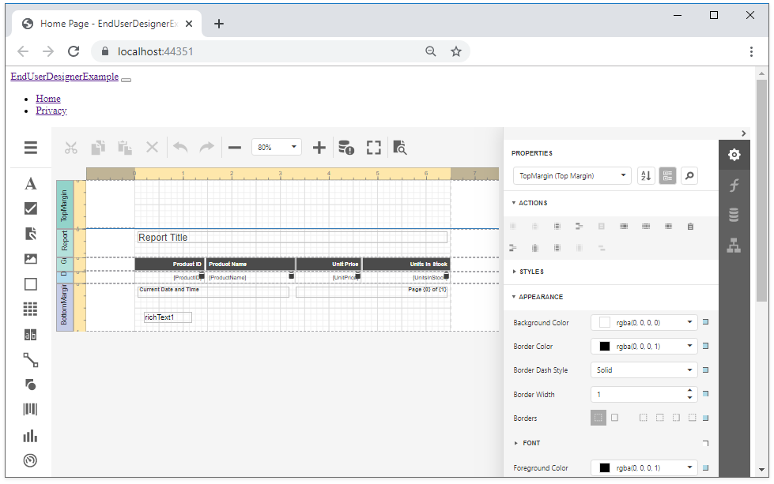

<!-- default file list -->
*Files to look at*:
* [Startup.cs](./CS/EndUserDesignerExample/Startup.cs) 
* [MyReportStorageWebExtension.cs](./CS/EndUserDesignerExample/Services/MyReportStorageWebExtension.cs)
<!-- default file list end -->

# How to Add an End-User Report Designer to an ASP.NET Core Application

This example is the resulting project if you follow the steps described in the [Add an End-User Report Designer to an ASP.NET Core Application](https://docs.devexpress.com/XtraReports/400042) document.

The report in this example is created as the [Create a Report in Visual Studio](docs.devexpress.devx/XtraReports/14989#table-report) document describes.

> Restore npm packages (listed in the [package.json](./CS/EndUserDesignerExample/package.json) file) before running this project.

